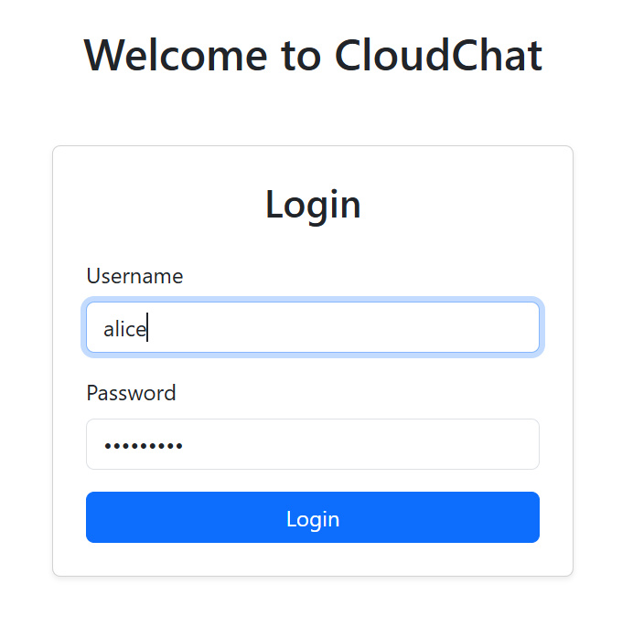
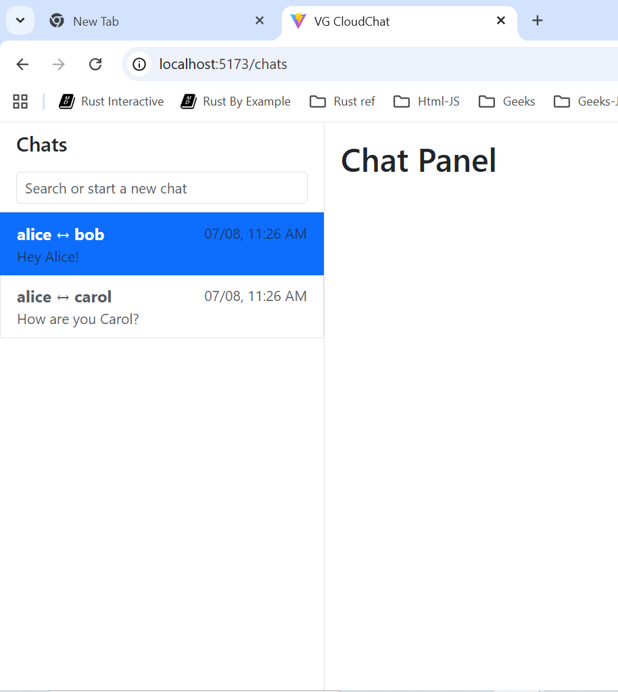

# 💬 CloudChat Lite — React Client (v1)


> **Production-style React SPA · Auth-aware routing · Explicit client/server state separation**  
> **Scope:** Frontend architecture, React patterns, and client-side integration

CloudChat Lite’s React client is a **single-page application** built to demonstrate modern React fundamentals: **composition, state isolation, async data management, routing, and backend integration**.

## 🏗 Tech Stack & Frontend Capabilities

| Area                    | Technology / Implementation                                  |
| ----------------------- | ------------------------------------------------------------ |
| Framework               | React (Vite-based SPA)                                       |
| Routing                 | React Router (protected routes, redirects)                   |
| State Management        | React Context + custom hooks                                 |
| Server State            | React Query (conversation list caching & lifecycle handling) |
| API Integration         | Axios with centralized abstraction layer                     |
| Authentication Handling | Context-driven auth state + route guards                     |
| UI & Layout             | Bootstrap (responsive, column-based layout)                  |
| Architecture            | Feature-based folders, clear separation of concerns          |
| Testing & Quality       | Vitest & RTL unit tests                                      |

## ✅ Implemented Use Cases

- User authentication (login flow)
- Address book retrieval and display
  - Client-side user search
- Conversation list retrieval for authenticated user

## 🚧 Not Implemented (v1)

- Message list retrieval and rendering per conversation

## 🧱 Architecture Notes (Selective Detail)

### Application Composition

- Root composition via **nested context providers**
  - `AuthProvider` for authentication state
  - `PhonebookProvider` for shared contact data
- Centralized routing via `AppRoutes`

### Backend Integration

- Axios abstraction located at `src/api/client.js`
- Consistent GET / POST helpers aligned with backend Lambdas

```js
callLambdaWithPost(endpoint, payload, accessToken);
callLambdaWithGet(endpoint, queryParams, accessToken);
```

## 📌 Status

Frontend v1 is intentionally scoped to **authentication, contacts, and conversation discovery**.
The client is structured to support message rendering, pagination, and richer UI state in subsequent iterations.

## 🖼 UI & Testing Evidence

Screenshots and test output are included to demonstrate UI behavior and engineering rigor.

- Unit test execution using Vitest & React Testing Library
- Login flow and authenticated routing
- Address book and conversation list rendering

**Test runner:** Vitest + React Testing Library  
**Command:**

```bash
npx vitest run
```


> **All UI screenshots reflect live data returned from the backend APIs.**



